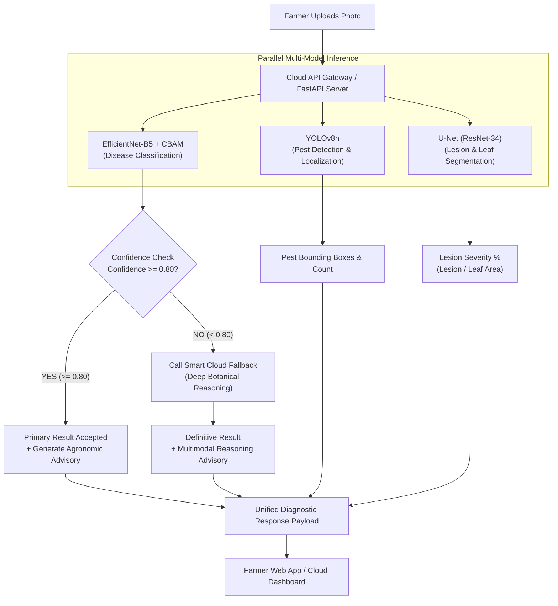

# 🌾 KisanDost — Multi-Model Cloud AI Agriculture Diagnostic Engine

End-to-End Cloud AI Agriculture Diagnostic System with Parallel Multi-Model Inference and Smart Fallback.

---

## 🏗️ Architecture Overview



---

## 🧩 Multi-Model Stack Components

1. **Main Classification:** `EfficientNet-B5 + CBAM` (Convolutional Block Attention Module)
   - **Channel Attention:** Focuses on *what* disease symptoms (color shifts, necrotic tissue, yellowing) are significant.
   - **Spatial Attention:** Focuses on *where* on the leaf surface the lesions are concentrated.
   - **Explainability:** Generates attention heatmaps returned to the user to visually substantiate predictions.

2. **Pest Detection & Localization:** `YOLOv8n`
   - Ultra-lightweight real-time pest detector identifying aphids, bollworms, armyworms, mites, whiteflies, and mealybugs.
   - Computes bounding boxes `[x1, y1, x2, y2]`, confidence scores, and returns coordinates.

3. **Lesion Severity Segmentation:** `U-Net (ResNet-34 Encoder)`
   - Dual-mask segmentation (Leaf Mask + Lesion Mask).
   - Computes accurate severity metric:
     $$\text{Lesion Area \%} = \frac{\text{Count}(\text{Lesion Pixels})}{\text{Count}(\text{Leaf Pixels})} \times 100$$
   - Categorizes damage into:
     - **Mild:** $< 10\%$
     - **Moderate:** $10\% - 30\%$
     - **Severe:** $> 30\%$

4. **Smart Cloud Fallback:**
   - Decision logic:
     - If EfficientNet-B5 confidence $\ge 0.80$: Primary classification is accepted.
     - If confidence $< 0.80$: Smart Fallback triggered. The raw image and top candidate classes are processed through deep multimodal botanical reasoning.

5. **Agronomic Advisory Engine:**
   - Chemical options with exact per-acre dosage scaling (`dosagePerAcre * landArea`).
   - Biological and organic remedies (NSKE, Trichoderma viride).
   - Cultural management and field sanitization practices.

---

## 🚀 Quick Start

### 1. Run the Cloud API Server
```bash
cd Model/api
python server.py
```
Server runs at `http://localhost:8000`.  
Interactive API docs available at `http://localhost:8000/docs`.

### 2. Open the Web Dashboard
Open `Model/web/index.html` directly in any web browser to test photo upload, real-time multi-model analysis, and treatment recommendations.

---

## 📡 API Specification

### `POST /api/v1/diagnose`
- **Body:** `multipart/form-data`
  - `file`: Crop leaf image file (JPEG, PNG, WebP)
  - `land_acres`: Plot size in acres (float, default: `1.0`)
- **Response:** JSON payload containing `diagnosis`, `pest_assessment`, `lesion_quantification`, and `advisory`.
