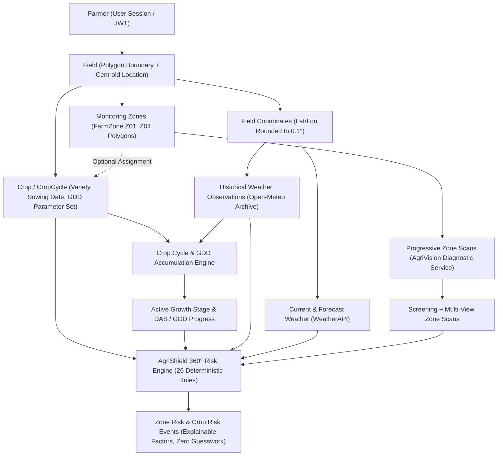

# AgriShield 360° / KisanDost — Phase 0–6 Comprehensive System Hand-off

This document serves as the formal engineering hand-off specification for KisanDost / AgriShield 360° covering Phases 0 through 6. It establishes the architectural baseline, data lineage, operational boundaries, security models, test verification results, and transition rules for incoming engineers (Developer 2).

---

## 1. Project Architecture & Philosophy

AgriShield 360° is designed as an evidence-driven, explainable, zero-hallucination agricultural intelligence platform integrated into KisanDost. 

### Core Architectural Principles
1. **Zero Hallucination / Zero Fabrication Policy**:
   - The platform strictly rejects synthetic, arbitrary, or ungrounded predictions.
   - Numeric risk scores are strictly forbidden in Phase 6; `riskScore` remains `null`.
   - When evidence is incomplete or thresholds are missing, the system explicitly reports `INSUFFICIENT_DATA` rather than guessing or defaulting to "healthy" or "low risk".
   - When multiple diagnostic images in a progressive scan conflict, the system evaluates to `INCONCLUSIVE`.
2. **Explicit Spatial Hierarchy**:
   - Agricultural risk does not exist in a geographic vacuum. All agronomic evaluations trace through a strict spatial chain from the authenticated farmer down to localized monitoring zones within bounded fields.
3. **Additive Engineering**:
   - New phases extend existing functionality through non-breaking domain models, dedicated service modules, and isolated API endpoints.
   - Core farmer-facing services (authentication, dashboard, crop records) remain resilient and backward-compatible.

---

## 2. Complete System Data Lineage

Every agronomic insight, phenological calculation, disease detection, and risk evaluation follows a traceable data lineage:



### Lineage Traceability Matrix
- **Farmer** (`User`): Authenticated via JWT bearer or secure cookie. Owns fields, zones, crop cycles, and scan sessions.
- **Field** (`Field`): Represents real estate with geographic location (`lat`, `lng`, `district`, `state`) and optional GeoJSON `boundary` polygon.
- **Monitoring Zone** (`FarmZone`): Discrete spatial management unit within a field (e.g., `Z01`, `Z02`) with polygon geometry, area, and centroid.
- **Crop / CropCycle** (`Crop`): Agronomic planting instance linked to `fieldId` and optionally assigned to a specific `zoneId`. References `icarCropId`, `varietyId`, and `gddParameterSetId`.
- **Weather Observation** (`WeatherObservation`): Daily observations (`Tmin`, `Tmax`, `precipitation`, `relativeHumidity`) indexed by 0.1° rounded coordinates and date.
- **Zone Disease Scan** (`CropDiseaseScan` & `ScanSession`): Progressive multi-view imagery tied directly to `fieldId`, `zoneId`, and `cropCycleId`.
- **Risk Assessment** (`RiskEvent`): Deterministic output evaluating weather stress, stage vulnerability, and visual pathology per crop and monitoring zone.

---

## 3. Phase 1 Data Foundation

Phase 1 established the authoritative agronomic master database extracted and validated directly from Indian Council of Agricultural Research (ICAR) official publications and research archives.

### Master Dataset Inventory
- **ICAR Master Crops**: 46 crops (`phase-1-data/crops.json` — 5 national priority crops: Wheat, Rice/Paddy, Maize, Mustard, Chickpea/Gram; plus 41 candidate agricultural crops).
- **ICAR Crop Varieties**: 654 validated commercial and institutional cultivars (`phase-1-data/varieties.json`), each indexed by `varietyId`, maturity duration, release year, recommended agro-climatic zones, and institutional pedigree.
- **Crop Growth Stages**: 19 phenological stages (`phase-1-data/growth_stages.json`) detailing base temperatures, critical thermal thresholds, and water requirements.
- **Pest & Disease Master References**: 1,503 validated pathology entries (`phase-1-data/crop_pest_disease_reference.json`) with biological vectors, symptoms, optimal infection temperature/humidity bands, and susceptible growth stages.
- **Agro-Weather Condition References**: 227 environmental stress rules (`phase-1-data/crop_weather_conditions.json`) defining thermal limits, drought indices, and moisture saturation thresholds.

All data files are versioned in `phase-1-data/` and loaded into MongoDB via `scripts/seed_icar_master_data.ts`.

---

## 4. GDD Parameter Data

Phase 3A/3B created the Growing Degree Day (GDD) foundation enabling real-time phenological tracking across microclimates.

### GDD Specifications
- **Parameter Sets**: 160 validated GDD parameter models (`gdd-research/validated/gdd_parameter_sets.json`).
- **Base Temperature (\(T_{base}\))**: Crop- and variety-specific baseline temperature below which vegetative development halts (e.g., 5.0°C for Wheat, 10.0°C for Rice and Maize).
- **Upper Cutoff Temperature (\(T_{upper}\))**: Maximum temperature beyond which physiological thermal efficiency plateaus or degrades (e.g., 30.0°C – 35.0°C).
- **Accumulation Methodology**: Modified Baskerville-Emin / standard thermal unit integration:
  \[
  GDD_{daily} = \max\left(0, \frac{\min(T_{max}, T_{upper}) + \max(T_{min}, T_{base})}{2} - T_{base}\right)
  \]
- **Traceability**: All 160 parameter sets include full academic citation indices recorded in `gdd-research/validated/GDD_SOURCE_TRACEABILITY.md` and seeded via `scripts/seed_gdd_parameter_sets.ts`.

---

## 5. Field & Zone Architecture

Fields and monitoring zones provide the physical spatial foundation for AgriShield 360°.

### Data Models & Spatial Logic
- **Field Model** (`src/models/Field.ts`):
  - Stores centroid coordinate (`location.coordinates` or `location.latitude`/`longitude`).
  - Contains optional `boundary` GeoJSON Polygon (`type: 'Polygon'`, `coordinates: [[[lng, lat], ...]]`).
  - Enforces closed polygon rings (minimum 4 coordinates, first and last coordinate identical).
- **Farm Zone Model** (`src/models/FarmZone.ts`):
  - Represents discrete management sub-units (`zoneCode`: `Z01`, `Z02`, etc.).
  - Linked to `farmerId` and `fieldId`.
  - Supports automated centroid resolution, bounding box calculation, and polygon subdivision via `src/lib/geoUtils.ts`.
- **APIs**:
  - `POST /api/fields/[id]/boundary`: Save and validate field GeoJSON polygon boundary.
  - `POST /api/fields/[id]/zones`: Generate or create monitoring zones within the boundary.
  - `GET /api/fields/[id]/zones`: Retrieve active monitoring zones.
  - `POST /api/fields/[id]/resolve-point`: Resolve a given GPS coordinate to its enclosing monitoring zone using ray-casting point-in-polygon logic.

---

## 6. Crop & Crop-to-Zone Relationship

The runtime crop planting instance represents the farmer's active season and bridges agronomic master data with spatial monitoring.

### Relationships
- **Crop Model** (`src/models/Crop.ts` & alias `CropCycle`):
  - Every crop belongs to a `farmerId` and a parent `fieldId`.
  - **Zone Association (`zoneId`)**: Optional `ObjectId` linking the crop to a specific `FarmZone`.
    - If `zoneId` is set, the crop cycle represents zone-level management.
    - If `zoneId` is `null`, the crop cycle spans the entire field, and zone-level risk evaluations evaluate field-level evidence.
  - **Phenology Tracking**:
    - `sowingDate`: Required timestamp anchoring cycle initiation.
    - `currentDas`: Days After Sowing dynamically calculated at query time.
    - `cumulativeGdd`: Total thermal units accumulated since sowing.
    - `currentStageId`: Active phenological milestone ID.
    - `progressionMode`: `'DYNAMIC_GDD'` (weather-driven), `'HYBRID_DAS'`, or `'DAS_ONLY'`.
- **UI Integration**:
  - Dashboard My Crops card displays the field name, district/state location, and monitoring zone badge (`Zone Z01` or `Field-wide`).
  - Direct navigation button connects each crop card to the dedicated detail view at `/crops/[id]`.

---

## 7. Phase 4 Progressive Zone Image Pipeline

Phase 4 implements a structured diagnostic scanning workflow that isolates plant disease detection to specific monitoring zones.

### Pipeline Mechanics
1. **Screening Scan**:
   - Initial wide shot or suspicious leaf photograph captured for a given zone.
   - Transmitted to the external AgriVision microservice (`/api/v1/diagnose`).
   - If diagnosis is conclusive with high confidence, diagnosis is finalized.
2. **Progressive Scan Session**:
   - If screening indicates ambiguity or requires multi-angle verification, a `ScanSession` is initiated.
   - Farmer is prompted for up to 3 additional perspective images (e.g., Close-up, Canopy context, Stem base).
   - Images are processed and stored via pluggable storage provider (`src/lib/imageStorage.ts`: Local filesystem, Cloudinary, or Cloudflare R2).
3. **Consensus Diagnosis**:
   - `CropDiseaseScan` records individual image results and the aggregated consensus.
   - If perspective diagnoses disagree, the pipeline strictly assigns `INCONCLUSIVE` — zero synthetic resolution.

---

## 8. Phase 5 Historical Weather Extension

Phase 5 extends the platform with persistent daily historical weather observations necessary for continuous GDD accumulation and weather-based disease risk forecasting.

### Technical Implementation
- **Weather Observation Model** (`src/models/WeatherObservation.ts`):
  - Unique compound index on `[latitudeRounded, longitudeRounded, observationDate]`.
  - Coordinates rounded to `0.1°` (~11 km) to maximize caching efficiency and deduplication.
  - Stores `temperatureMax`, `temperatureMin`, `temperatureMean`, `precipitationSum`, `relativeHumidityMax`, `relativeHumidityMin`, `relativeHumidityMean`, `windSpeedMax`, `solarRadiationSum`.
  - Nullable fields: Missing sensor readings remain strictly `null`; values are never fabricated.
- **Provider & Integration** (`src/lib/weather/`):
  - Integrates with Open-Meteo Historical Archive API for historical backfill and WeatherAPI.com for near-term forecasts.
  - Automatic missing date detection and coverage ratio computation.
  - Daily weather retrieval seamlessly feeds into `gddCalculator.ts` to compute cumulative thermal progression without mock data.

---

## 9. Phase 6 AgriShield 360° Risk Engine

Phase 6 implements a deterministic, explainable multi-factor agricultural risk engine.

### Architecture
- **Rules Foundation** (`src/lib/risk/riskRules.ts`):
  - **26 Total Registered Rules**:
    - **20 Fully Computational Rules**: Evaluate thermal extremes, drought stress, moisture saturation, stage-specific heat vulnerability, blast/rust environmental favorability, and visual scan confirmations.
    - **6 Explicit INSUFFICIENT_DATA Rules**: Guard rails that trigger when required sensor variables (e.g., solar radiation, canopy humidity) are absent.
- **Evaluation Pipeline** (`src/lib/risk/riskEvaluator.ts`):
  - Accepts `RiskEvidence` bundle containing: crop profile, active growth stage, cumulative GDD/DAS, 14-day weather window, 3-day forecast, and recent zone disease scans.
  - Executes all applicable rules concurrently without side effects.
  - Aggregates rule outcomes into overall `CropRiskSummary` and `ZoneRiskSummary`.

---

## 10. Categorical Risk States

To eliminate false precision and artificial mathematical models, AgriShield 360° uses categorical risk states.

### State Definitions
| State | Semantic Meaning | System Behavior |
|-------|------------------|-----------------|
| `LOW` | Environmental conditions and visual scans show no active threats. | Normal agronomic schedule; routine monitoring advised. |
| `MODERATE` | Weather conditions moderately favor stress or pathogen incubation; or sub-critical thermal threshold crossed. | Heightened monitoring alert; preventative advisory issued. |
| `HIGH` | Critical threshold breached (severe heat stress, water saturation during flowering, or confirmed pathogen scan). | Immediate farmer notification; diagnostic verification requested. |
| `INSUFFICIENT_DATA` | Necessary weather observations or agronomic thresholds are absent from the dataset. | System transparently flags missing variables; never defaults to Low risk. |
| `INCONCLUSIVE` | Multiple visual scan images return conflicting disease diagnoses. | Requests expert review or fresh scan session; no synthetic consensus. |

**Numeric Risk Score Rule**: `riskScore` is strictly `null` in all Phase 6 responses and database records.

---

## 11. Current Geographic Limitation

> [!WARNING]
> **Geographic Risk Filtering is NOT Implemented.**

- Latitude and longitude coordinates stored on fields are used **solely** for weather observation lookups (Open-Meteo and WeatherAPI).
- The platform does **NOT** currently filter pest or disease risks by administrative state, agro-ecological sub-zone, or geographic regional quarantine boundaries.
- Any upcoming phase (e.g., Phase 7) must not assume or display regional pathogen distribution filtering until an official spatial quarantine dataset is integrated.

---

## 12. Current Crop Coverage

The platform's deep phenological and thermal intelligence is currently operational on:
- **Primary Priority Crops (5)**:
  1. Wheat (*Triticum aestivum*)
  2. Rice / Paddy (*Oryza sativa*)
  3. Maize (*Zea mays*)
  4. Mustard (*Brassica juncea*)
  5. Chickpea / Gram (*Cicer arietinum*)
- **Total Master Crop Index**: 46 ICAR botanical crop definitions.
- **Varietal Records**: 654 cataloged varieties.
- Crops outside the 5 priority crops operate in standard DAS tracking mode (`DAS_ONLY`) until GDD calibration is established for their specific cultivars.

---

## 13. Current Data Limitation

1. **Growth Stage Records**: 19 standardized growth stages are calibrated across priority crops. Micro-stages (e.g., Zadoks decimal stages for small grains) are grouped into primary operational phases (Germination, Vegetative, Tillering/Branching, Flowering/Anthesis, Grain Filling, Maturity).
2. **Sensor Variables**: In rural areas without on-field IoT weather stations, relative humidity and solar radiation may have missing historical intervals. The system handles this gracefully via `INSUFFICIENT_DATA` rules.

---

## 14. Weather Rule Limitation

1. Weather rules evaluate historical daily observations up to the current date and forecast models up to 14 days ahead.
2. Microclimate phenomena (e.g., localized field depressions causing frost pocketing, canal-adjacent localized fog) are not measured unless captured by satellite reanalysis or local weather stations.
3. Wind-borne spore dispersion models (HYSPLIT trajectory modeling) are not part of Phase 6 rules.

---

## 15. Endpoints & APIs

All endpoints require authentication and enforce multi-tenant authorization:

### Spatial & Field APIs
- `GET /api/fields`: List all fields for authenticated farmer.
- `POST /api/fields`: Create new field with location coordinates.
- `GET /api/fields/[id]`: Retrieve field details including boundary and crops.
- `POST /api/fields/[id]/boundary`: Save GeoJSON polygon boundary.
- `GET /api/fields/[id]/zones`: List monitoring zones for field.
- `POST /api/fields/[id]/zones`: Generate or save monitoring zones.
- `POST /api/fields/[id]/resolve-point`: Resolve a coordinate to its containing monitoring zone.

### Crop & Lifecycle APIs
- `POST /api/fields/[id]/crops`: Plant new crop cycle; supports optional `zoneId`.
- `GET /api/crops/[id]`: Retrieve crop cycle details.
- `GET /api/crops/[id]/cycle`: Calculate runtime DAS, cumulative GDD, and current growth stage.
- `GET /api/crops/[id]/scans`: Retrieve historical disease scans for crop with populated zone details.

### Disease Scanning APIs (Phase 4)
- `POST /api/crops/[id]/zones/[zoneId]/scan`: Submit progressive disease scan for a zone.

### Weather APIs (Phase 5)
- `GET /api/weather`: Real-time current weather and 14-day forecast for GPS coordinates.
- `GET /api/weather/historical`: Daily historical weather observations for coordinate and date range.
- `GET /api/crops/[id]/weather`: Weather history spanning sowing date to present for a crop.

### AgriShield Risk APIs (Phase 6)
- `GET /api/crops/[id]/risk`: Comprehensive field-level risk assessment for crop cycle.
- `GET /api/crops/[id]/zones/[zoneId]/risk`: Zone-specific risk assessment isolating localized scan evidence.

---

## 16. Multi-Tenant Security & Tenant Isolation

Tenant isolation is enforced across every layer of the backend:

1. **Authentication Boundary**:
   - `auth()` extracts authenticated `farmerId` from session cookies or JWT bearer tokens.
   - Unauthenticated requests immediately terminate with `401 Unauthorized`.
2. **Database Query Guard**:
   - No database update or retrieval queries by `_id` alone.
   - All operations enforce compound ownership: `{ _id: resourceId, farmerId: session.farmerId }`.
   - Access attempts to resources owned by another farmer return `404 Not Found` (preventing ID enumeration).
3. **Cross-Tenant Validation**:
   - When assigning a `zoneId` to a crop, the API validates that both the field and the zone are owned by the authenticated farmer. Cross-farmer zone hijacking is strictly blocked.

---

## 17. Automated Test Suite Results

All Phase 0 through 6 functionality is verified by 5 dedicated automated test suites plus full TypeScript type checking and Next.js production builds.

| Test Suite | File | Tests Run | Result |
|------------|------|-----------|--------|
| **Phase 0–6 Spatial & Tenant Security** | `scripts/test_location_zone_integration.ts` | 17 | **17 / 17 Passed (100%)** |
| **Phase 3C Crop Cycle & GDD Engine** | `scripts/test_phase3c_crop_cycle.ts` | 50 | **50 / 50 Passed (100%)** |
| **Phase 4 Progressive Image Pipeline** | `scripts/test_phase4_image_pipeline.ts` | 50 | **50 / 50 Passed (100%)** |
| **Phase 5 Historical Weather Foundation** | `scripts/test_phase5_weather.ts` | 40 | **40 / 40 Passed (100%)** |
| **Phase 6 AgriShield 360° Risk Engine** | `scripts/test_phase6_risk_engine.ts` | 38 | **38 / 38 Passed (100%)** |
| **Total Automated Tests** | — | **195** | **195 / 195 Passed (100%)** |
| **TypeScript Static Check** | `npx tsc --noEmit` | Project-wide | **0 Errors** |
| **Next.js Production Build** | `npm run build` | App Router | **Success (Exit Code 0)** |

---

## 18. Known Limitations & Constraints

1. **AgriVision Microservice Dependency**:
   - Disease classification requires network access to the AgriVision endpoint. When offline, image uploads succeed but diagnostic classification is marked pending.
2. **Single Boundary Ring**:
   - Field boundaries support single closed polygon exterior rings. Multipolygon or doughnut hole exclusions are not yet supported.
3. **GDD Missing Temperature Fallback**:
   - If historical temperature records are missing for a specific date, GDD accumulation skips the unobserved day and logs a data coverage warning rather than interpolating synthetic temperatures.

---

## 19. Phase 7 Boundary

> [!IMPORTANT]
> **Phase 7 Scope Boundary**:
> Phase 7 encompasses **Actionable Advisory, IPM Recommendations, and Intervention Scheduling**.
> 
> Phase 7 is NOT yet implemented. Do NOT create advisory or IPM logic in Phase 6.

### Phase 7 Responsibilities (Future Work)
- Translating `RiskEvent` outputs into non-chemical cultural practices, biological controls, and chemical intervention options.
- Dynamic calculation of pre-harvest intervals (PHI) and re-entry intervals (REI).
- SMS and Push notification dispatch for high-risk alerts.
- Farmer action confirmation and treatment logging.

---

## 20. What Phase 7 Must Not Assume

Developer 2 must adhere strictly to these negative constraints when designing Phase 7:
1. **DO NOT Assume Numeric Scores**: Do not write advisory logic that expects a score from 0 to 100. Consume categorical `riskStatus` (`LOW`, `MODERATE`, `HIGH`, `INSUFFICIENT_DATA`).
2. **DO NOT Assume Geographic Filtering**: Do not assume pest presence is geographically filtered by district or state.
3. **DO NOT Assume Perfect Weather Coverage**: Always handle cases where weather variables are `null`.
4. **DO NOT Assume Disease Diagnostic Certainty**: Always respect `INCONCLUSIVE` or `isUndetermined` status from AgriVision scans.
5. **DO NOT Bypass Tenant Isolation**: Always verify farmer ownership on all new advisory endpoints.

---

## 21. Hand-off Rule for Developer 2

Before modifying or extending any code in AgriShield 360°:
1. **Inspect Existing Audits**: Developer 2 must read `phase-1-data/PHASE_6_LOCATION_ZONE_AUDIT.md` and `phase-1-data/PHASE_6_RULE_AUDIT.md`.
2. **Run All Test Suites**: Confirm local test execution passes 195/195 tests before making code changes:
   ```bash
   cd kisan-dost/ventureHack/kisan-next
   npx tsx scripts/test_location_zone_integration.ts
   npx tsx scripts/test_phase3c_crop_cycle.ts
   npx tsx scripts/test_phase4_image_pipeline.ts
   npx tsx scripts/test_phase5_weather.ts
   npx tsx scripts/test_phase6_risk_engine.ts
   ```
3. **Preserve Zero Hallucination Standard**: Any new rule, advisory, or recommendation must be grounded in verified agronomic source data. If data is lacking, emit `INSUFFICIENT_DATA`.
