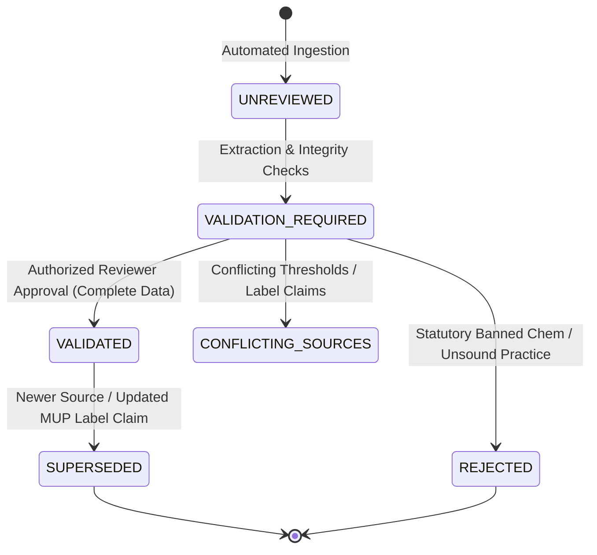

# Phase 8 — Agricultural Knowledge Governance & ETL/IPM Expansion Specification

**System:** KisanDost / AgriShield 360°  
**Phase:** Phase 8 — Agricultural Knowledge Governance + ETL/IPM Expansion  
**Date:** 2026-09-25  
**Version:** 1.0.1 (Reconciled Production Baseline)  
**Applicability:** Production Advisory Resolver, Admin Knowledge Console, Regulatory Auditing Pipeline  

---

## 1. Executive Summary & Purpose

Phase 8 establishes a strictly governed, source-traceable, version-controlled agricultural knowledge system for AgriShield 360°. It expands upon the verified baseline of Phases 0–7 (235 tests passing) by transforming raw agricultural documentation and statutory regulatory registers into machine-evaluable, human-validated agronomic rules.

### Core Architectural Principles
1. **Provenance First:** Every recommendation exposed to an Indian farmer is strictly traceable to an authoritative issuing body, specific publication, edition/date, and document page/section.
2. **Human-in-the-Loop Validation:** Extracted candidate knowledge is never automatically exposed to production advisory resolution. Rules transition through a formal multi-stage validation workflow (`UNREVIEWED` → `VALIDATION_REQUIRED` → `VALIDATED` / `REJECTED` / `CONFLICTING_SOURCES` / `SUPERSEDED`).
3. **Statutory Chemical Safety Gate:** Chemical recommendations must satisfy zero-tolerance regulatory gates:
   - Absolute exclusion of the 49 banned pesticides and 18 refused active ingredients listed under the Insecticides Act, 1968.
   - Strict enforcement of crop-specific statutory restrictions (e.g. S.O. 4294(E) prohibiting Dimethoate on vegetables and fruits).
   - Mandatory completeness criteria: formulation, recommended dose, dilution, Pre-Harvest Interval (PHI), and Re-Entry Interval (REI) must be verified from CIB&RC Major Uses of Pesticides (MUP) registrations.
   - Missing data results in graceful chemical suppression with an explicit, farmer-friendly safety explanation, prioritizing biological and cultural remedies.
4. **Non-Destructive Ingestion & Deduplication:** Confirmed duplicate files (such as `*1.pdf` variants) are programmatically ignored and reported without modifying or deleting files on disk.

---

## 2. Ingested Sources & Exclusion Catalog

A comprehensive physical inventory of `kisandost/Temp-data/` identified **21 total files**:
- **16 Registered Sources:** 15 current/official agricultural-regulatory sources + 1 historical non-regulatory treatise.
- **5 Excluded Duplicates:** Confirmed duplicates ending in `1.pdf` audited and quarantined without deletion.

```
kisandost/Temp-data/ Inventory (21 Files)
├── Primary Agricultural IPM Packages: 6 files (IN-SCOPE)
│   ├── Wheat.pdf (83 pages, DPPQS/NIPHM)
│   ├── Rice.pdf (53 pages, NCIPM/DPPQS)
│   ├── Maize.pdf (56 pages, NCIPM/DPPQS)
│   ├── Mustard.pdf (59 pages, NIPHM/DPPQS)
│   ├── Chickpea.pdf (56 pages, NCIPM/DPPQS)
│   └── farmerbook.pdf (154 pages, GIZ/MANAGE)
├── Duplicate Files (*1.pdf): 5 files (AUDITED & EXCLUDED)
│   ├── Wheat1.pdf (Duplicate of Wheat.pdf)
│   ├── Rice1.pdf (Duplicate of Rice.pdf)
│   ├── Maize1.pdf (Duplicate of Maize.pdf)
│   ├── Mustard1.pdf (Duplicate of Mustard.pdf)
│   └── Chickpea1.pdf (Duplicate of Chickpea.pdf)
├── Historical Agricultural Literature: 1 file (.txt, 2.53 MB)
│   └── 353268719-Handbook-of-Indian-Agriculture-1000064340.txt (N.G. Mukerji 1915, Sibpur)
└── Central Regulatory Authorities (CIB&RC / DPPQS): 9 files (REGULATORY GATES)
    ├── updated_mup_insecticide_as_on_31.03.2026_c.pdf (Insecticide MUP)
    ├── 2._chemical_mup_fungicide_as_on_31.03.2026_0.pdf (Fungicide MUP)
    ├── 3._bio_pesticide_mup_biofungicide_as_on_31.03.2026.pdf (Biofungicides)
    ├── 4._herbicides_mup_as_on_31.03.2026.pdf (Herbicides MUP)
    ├── 5._pgr_mup_as_on_31.03.2026.pdf (Plant Growth Regulators)
    ├── 6._mup_bio_insecticide_31.03.2026.pdf (Bio-insecticides)
    ├── list_of_pesticides_which_are_banned_refused_registration_and_restricted_in_use.pdf (Statutory Exclusions)
    ├── list_pf_pesticide_formulations_registered_as_on_31.03.2026.pdf (Approved Formulations)
    └── 476th RC MOM.pdf (Registration Committee Minutes)
```

### 2.1. Historical Treatise Handling (*Handbook of Indian Agriculture*, 1915)
The TXT treatise `353268719-Handbook-of-Indian-Agriculture-1000064340.txt` is *Handbook of Indian Agriculture (3rd Edition, 1915)* by Nitya Gopal Mukerji, Thacker Spink & Co, Calcutta. A comprehensive workspace search verified that no separate "ICAR Handbook of Agriculture TXT" exists.
- **Classification:** `HISTORICAL_TREATISE`, 1915, non-regulatory (`isRegulatoryAuthority: false`).
- **Agronomic Knowledge:** Traditional practices such as drainage of heavy clay soils, border intercropping, solar heat seed treatment, and rotational fallows are preserved as valid cultural knowledge (e.g. `IPM-HIST-RICE-CULT-01`).
- **Archaic Chemical Knowledge:** Recommendations involving obsolete chemicals (e.g. copper acetoarsenite / Paris Green, lead arsenate, crude kerosene emulsions) are marked **`SUPERSEDED`** and **`REJECTED`** under modern statutory law.
- **Regulatory Status:** The TXT file cannot be cited as legal pesticide approval.

---

## 3. Knowledge Validation & Versioning Lifecycle

Knowledge records stored in `agri_ipm_rules` follow a strict finite-state machine to guarantee that unvalidated data never leaks into farmer advisories.



### 3.1. Rule States
| State | Farmer-Actionable? | Description |
| :--- | :--- | :--- |
| `UNREVIEWED` | **NO** | Newly ingested rule from PDF/TXT pipeline pending automated sanity parsing. |
| `VALIDATION_REQUIRED` | **NO** | Candidate rule missing one or more non-critical parameters (e.g. unverified PHI or regional applicability). |
| `VALIDATED` | **YES** | Rule fully verified by an authorized agronomist or reviewer; complete CIB&RC citations attached. |
| `REJECTED` | **NO** | Rule uses banned pesticides, prohibited tank mixes, or unscientific remedies. |
| `CONFLICTING_SOURCES` | **NO** | Discrepancy detected between multiple sources; quarantined pending committee reconciliation. |
| `SUPERSEDED` | **NO** | Historically valid rule replaced by a newer version (`ruleVersion` incremented, `isCurrent: false`). |

### 3.2. Version Governance Mechanics
1. **Immutable Historical Records:** Rules are never physically deleted from the database.
2. **Current Pointer (`isCurrent`):** Only rules with `isCurrent: true` and `supersededBy: null` can be queried by the advisory resolver.
3. **Lineage Tracking:** When an existing rule is revised:
   - A new rule document is inserted with `ruleVersion = previousVersion + 1`.
   - The predecessor rule is updated to `validationStatus = 'SUPERSEDED'`, `isCurrent = false`, and `supersededBy = newRule._id`.

---

## 4. Strict Chemical Safety & Regulatory Gates

The `regulatoryService.ts` module implements zero-tolerance gates before any chemical intervention is presented to the farmer:

### 4.1. Gate Checklist
```
                       [Candidate Chemical Action]
                                    │
                  Is Active Ingredient Banned/Refused?
                        ┌───────────┴───────────┐
                      YES                       NO
                       │                         │
              [REJECT: STATUTORY BANNED]   Is it Restricted for Crop?
                                                ┌────────┴────────┐
                                              YES                 NO
                                               │                  │
                                      [REJECT: RESTRICTED]  Is Dosage & Unit Present?
                                                                  ┌────────┴────────┐
                                                                 NO                YES
                                                                  │                 │
                                                        [SUPPRESS: NO DOSE]  Is PHI >= 0 Days Present?
                                                                                    ┌────────┴────────┐
                                                                                   NO                YES
                                                                                    │                 │
                                                                          [SUPPRESS: NO PHI]   Is Method Present?
                                                                                                      ┌────────┴────────┐
                                                                                                     NO                YES
                                                                                                      │                 │
                                                                                            [SUPPRESS: NO METHOD] [APPROVED FOR USE]
```

### 4.2. Statutory Exclusions
1. **49 Banned Pesticides:** Includes Endosulfan, Aldrin, Chlordane, Dichlorvos (DDVP), Lindane, Methyl Parathion, Phorate, Phosphamidon, and Triazophos.
2. **18 Refused Registrations:** Includes Azinphos-methyl, Binapacryl, Calcium Arsenate, Chinomethionate, and Dicrotophos.
3. **Crop-Specific Restrictions:**
   - **Dimethoate:** Permitted on field crops (Mustard, Wheat), strictly banned on vegetables and fruits (S.O. 4294(E)).
   - **Mancozeb:** Permitted on field crops; excluded within 30 days of direct fresh market harvest.
   - **Granular Insecticides on Maize:** Banned granular organophosphates (Carbofuran, Phorate) replaced with liquid whorl chlorantraniliprole.

### 4.3. Missing Data Policy
If an agronomic rule is valid culturally or biologically but lacks verified chemical dosage or PHI in the CIB&RC MUP:
- The rule remains active for cultural/biological/mechanical actions.
- The `chemicalAction.offered` flag is set to `false`.
- A transparent safety reason is displayed:
  > *"Chemical recommendation unavailable because the source information is incomplete or not validated."*
- Model hallucinations or statistical inferences of dosage and PHI are strictly forbidden.

---

## 5. Advisory Resolver Integration

The production `advisoryResolver.ts` was upgraded to consume only valid Phase 8 rules:

```typescript
// Query filter in advisoryResolver.ts
const matchedRules = await AgriIpmRule.find({
  cropName: { $regex: new RegExp(`^${cropName}$`, 'i') },
  targetThreatName: { $regex: new RegExp(escapedThreat, 'i') },
  validationStatus: 'VALIDATED',
  $or: [{ isCurrent: true }, { isCurrent: { $exists: false } }],
  $and: [{ supersededBy: null }],
}).sort({ ruleVersion: -1, createdAt: -1 }).lean();
```

### Resolution Rules
1. **Priority Matching:** Matches exact crop → exact pest/disease → current growth stage.
2. **Exclusion Filter:** Any candidate rule with status `UNREVIEWED`, `VALIDATION_REQUIRED`, `REJECTED`, or `SUPERSEDED` is dropped.
3. **Chemical Evaluation:** The candidate chemical option is passed through `validateChemicalSafety()`. If approved, `chemicalAction.offered = true` with exact active ingredient, formulation, dose, unit, dilution, PHI, and REI.
4. **Source Attribution:** The advisory attaches verified source references (`organization`, `title`, `page`) so the farmer or extension officer can verify the advice.

---

## 6. Automated Quality Auditor & Coverage Metrics

The `qualityAuditor.ts` module runs automated sanity checks across the knowledge base:

### Audit Rules
- **Rule Code Uniqueness:** Prevents duplicate rule definitions.
- **Provenance Integrity:** Flags rules lacking organization, document title, or page numbers.
- **Banned Substance Scanner:** Detects any rule referencing banned or refused chemicals.
- **PHI Verification:** Flags validated rules with chemical actions that lack explicit waiting periods.
- **Superseded Current State:** Detects rules where `supersededBy` is set but `isCurrent` remains true.

### Priority Crop Knowledge Metrics (Reconciled Live Database State)

| Crop | Total Rules | Disease Rules | Pest Rules | ETL Covered | Chemical Rules | PHI Covered | Validated | Pending / Quarantined |
| :--- | :---: | :---: | :---: | :---: | :---: | :---: | :---: | :---: |
| **Wheat** | 6 | 5 | 1 | 5 | 5 | 4 | 5 | 1 (`CONFLICTING_SOURCES`) |
| **Rice** | 7 | 4 | 2 | 7 | 6 | 5 | 6 | 1 (`VALIDATION_REQUIRED`) |
| **Maize** | 4 | 2 | 2 | 4 | 4 | 4 | 4 | 0 |
| **Mustard** | 5 | 2 | 3 | 4 | 5 | 5 | 4 | 1 (`REJECTED`) |
| **Chickpea** | 4 | 3 | 1 | 4 | 2 | 2 | 4 | 0 |
| **Cotton** (Ref) | 1 | 1 | 0 | 1 | 1 | 1 | 1 | 0 |
| **TOTAL** | **27** | **17** | **9** | **25** | **23** | **21** | **24** | **3** |

---

## 7. Admin Validation Review Interface

An administrative review dashboard is provided at `/dashboard/knowledge-governance`:
- **Role-Based Access Control:** Strictly restricted to users with `role: 'admin'` or `role: 'reviewer'`. Regular farmers are denied access with `403 Forbidden`.
- **Status Tabs:** Filter by *Pending Validation*, *Validated*, *Conflicting*, *Superseded*, and *Rejected*.
- **Review Controls:**
  - **Validate:** Promotes candidate rule to `VALIDATED` and marks `isCurrent = true`.
  - **Reject:** Sets status to `REJECTED`, `isCurrent = false`.
  - **Flag Conflict:** Sets status to `CONFLICTING_SOURCES` and requires reviewer explanation notes.
  - **Supersede:** Sets status to `SUPERSEDED`, links newer rule ID, and sets `isCurrent = false`.
- **Evidence Panel:** Displays source title, page number, issuing organization, symptoms, ETL, and full chemical safety attributes.

---

## 8. Definition of Done Compliance Matrix

| Requirement | Implementation Component | Status |
| :--- | :--- | :--- |
| Inventory & catalog sources | `docs/PHASE_8_SOURCE_CATALOG.md` (16 registered sources: 15 official + 1 historical) | ✅ PASS |
| Exclude `*1.pdf` duplicates | Regex filter in `ingest_phase8_agri_knowledge.ts` (5 excluded) | ✅ PASS |
| Historical TXT Audit | `SRC-MUKERJI-HANDBOOK-1915` registered as historical treatise (1915, non-regulatory) | ✅ PASS |
| Preserve Phase 0–7 data | All 235 existing tests passing without regression | ✅ PASS |
| Source Registry model | `src/models/AgriSourceRegistry.ts` (16 sources in DB) | ✅ PASS |
| Rule versioning & provenance | `src/models/AgriIpmRule.ts` extended with version lineage | ✅ PASS |
| Human validation workflow | `api/admin/ipm-rules` + Governance UI (`/dashboard/knowledge-governance`) | ✅ PASS |
| Strict chemical safety gate | `src/lib/governance/regulatoryService.ts` | ✅ PASS |
| Banned & restricted checks | 49 banned, 18 refused, and Dimethoate S.O. 4294(E) crop restrictions | ✅ PASS |
| Coverage metrics | Reconciled 27 total rules, 24 validated, 3 quarantined | ✅ PASS |
| Idempotent ingestion pipeline | `scripts/ingest_phase8_agri_knowledge.ts` (0 duplicates on re-run) | ✅ PASS |
| Reviewer authorization UI | `/dashboard/knowledge-governance` (RBAC protected) | ✅ PASS |
| Production resolver compliance | `src/lib/advisory/advisoryResolver.ts` (queries only VALIDATED + isCurrent) | ✅ PASS |
